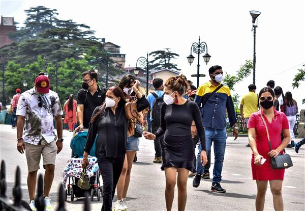
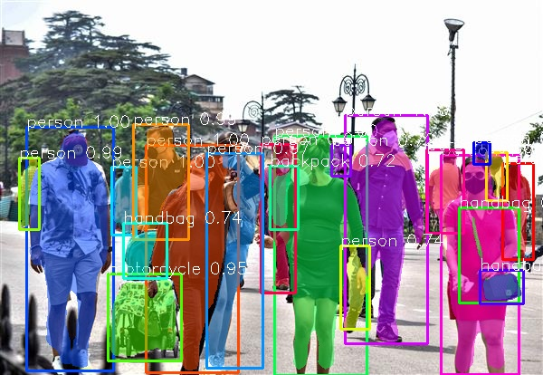
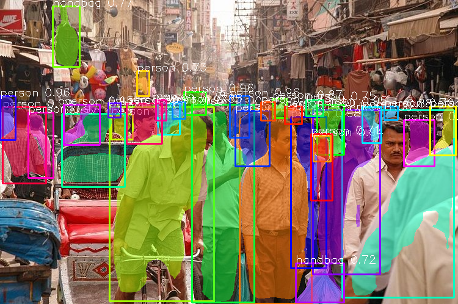
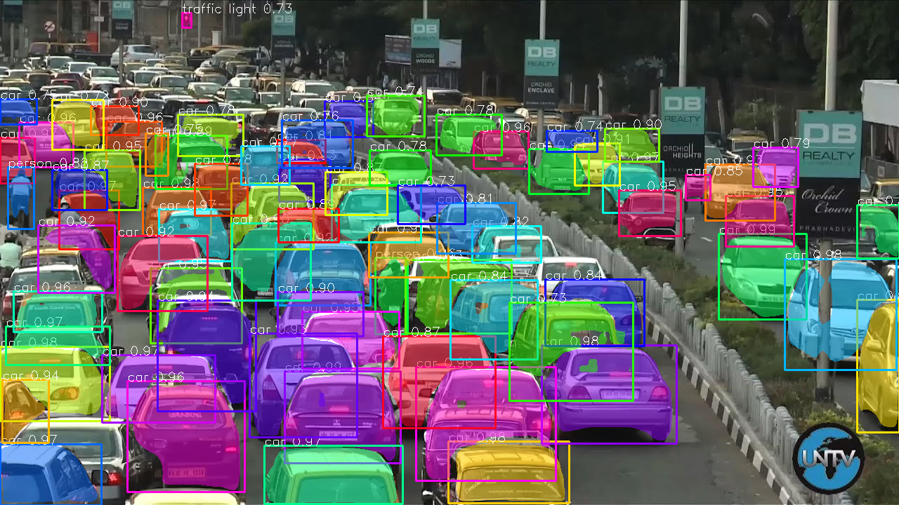
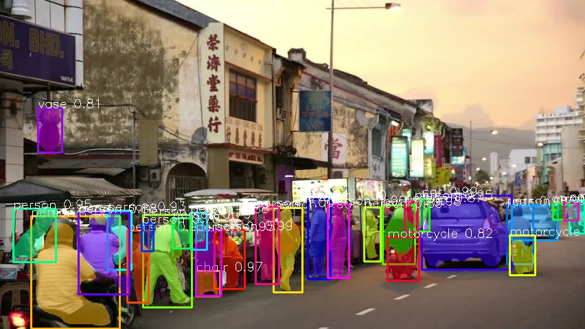

# ✨ Instance Segmentation using PixelLib 🙆‍♂️
A streamlit based webapp to perform SOTA instance segmentation on images, videos and live webcam feed

------------
## Results 
------------

### Images
| **Original Image**  | **Segmented Image**  |
|---------------------|-----------------------|
|   |   |
|   |   |
|   |   |
|  |   |
 

# Videos
| **Original Video**  | **Segmented Video**  |
|---------------------|-----------------------|
|   |   |
|   |   |
|   |   |
|  |   |

# Live Webcam Feed
***coming soon...***
